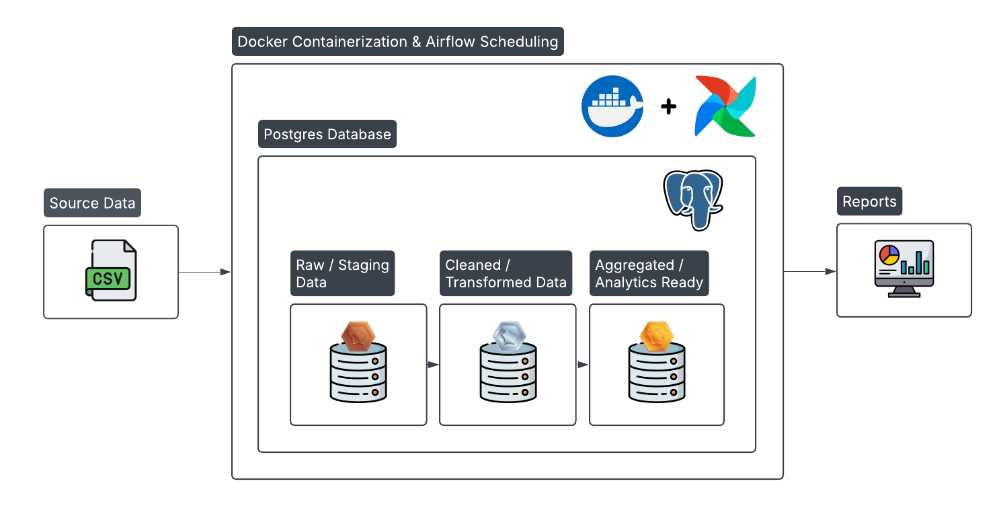
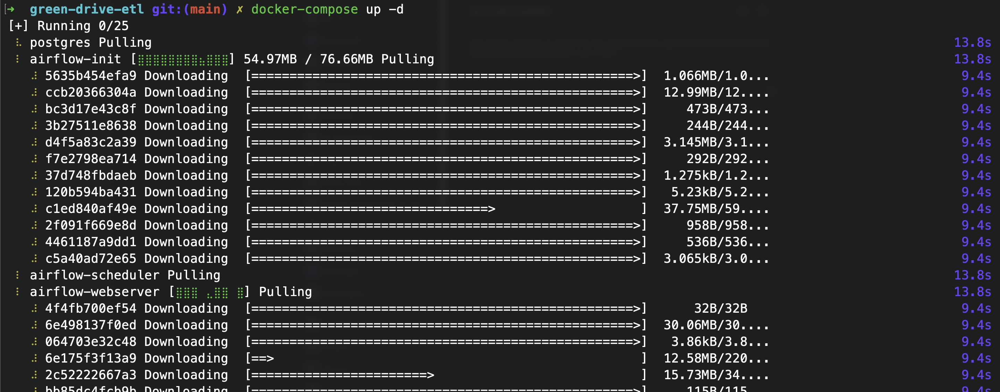
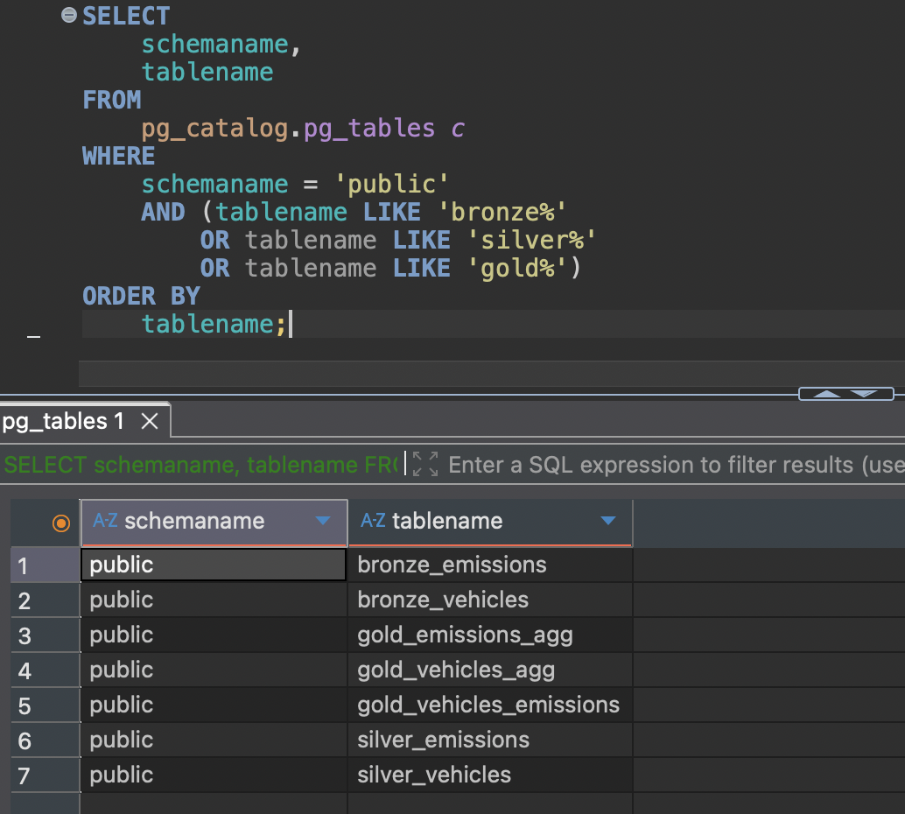
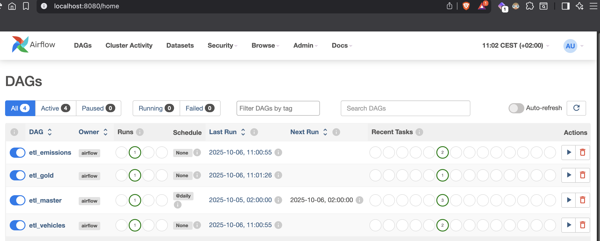
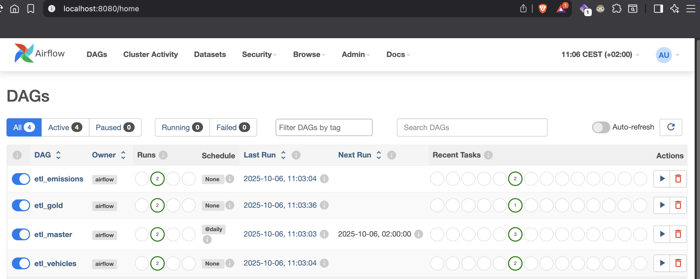

# 🚗 Green Drive ETL Pipeline

## 🧭 Introduction

This project implements a containerized ETL pipeline for vehicle and emissions data using **Docker** and **Airflow**. The pipeline ingests raw CSV files, transforms and cleans data, and aggregates it for analytics and reporting. The goal is to demonstrate modular, reproducible ETL workflows with best practices for orchestration, logging, and incremental data loading.

## 🧰 Technologies Used

- **Docker & Docker Compose** – Containerization for Airflow and PostgreSQL
- **Airflow** – DAG-based workflow orchestration and scheduling
- **PostgreSQL** – Staging and analytics database
- **Pandas** – Data processing and transformation
- **SQLAlchemy** – Database connection management 

## 🔄 Pipeline Flow



---

## 📁 Directory Structure

- `dags/` – Airflow DAG definitions (Bronze, Silver, Gold pipelines)
- `data/` – Raw CSV files for vehicles and emissions ([data/README](data/README.md), [website link](https://www.fueleconomy.gov/feg/download.shtml))
- `docker-compose.yml` – Docker Compose configuration for Airflow and PostgreSQL
- `requirements.txt` – Python dependencies for ETL scripts
- `plugins/` – Custom Airflow operators, hooks, or macros (optional)
- `logs/` – Airflow runtime logs (generated after execution, ignored by Git)

---

## ⚙️ ETL Job Overview

The ETL pipeline is orchestrated via **Airflow** and runs inside a **Docker container**. The workflow is initiated by starting `docker-compose`, which creates and configures the necessary containers for **PostgreSQL**, **Airflow webserver**, **scheduler**, and **init**, while mounting the project directories.

### 🐳 1. Docker Initialization

Running `docker-compose up` starts all containers:

- **PostgreSQL** – Stores Bronze, Silver, and Gold tables
- **Airflow** – Orchestrates ETL DAGs and manages scheduling



---

### 🥉 2. Bronze Layer

- Raw CSV files (`vehicles.csv`, `emissions.csv`) are ingested
- If a table does not exist, it is **created**
- If a table exists, only **new rows are appended**

---

### 🥈 3. Silver Layer

- Data is **cleaned and normalized**
- Duplicate rows are removed
- Nullable integer columns are handled using `Int64` type in Pandas
- Clean tables are saved as `silver_vehicles` and `silver_emissions`

---

### 🥇 4. Gold Layer

- Silver tables are aggregated to generate:
  - `gold_vehicles_agg` (average CO2 & barrels08 per make/year)
  - `gold_emissions_agg` (average emission scores per vehicle)
  - `gold_vehicles_emissions` (combined aggregated table)
- Aggregated tables use `if_exists="replace"` to refresh the data

---

### 🗄️ 5. PostgreSQL Verification

Tables created and updated during the ETL process can be verified in PostgreSQL using DBeaver or any SQL client:



---

### 🧩 6. Orchestration

- The **`etl_master`** DAG triggers `etl_vehicles` and `etl_emissions`, waits for their completion, then triggers `etl_gold`
- Ensures dependencies are respected and Gold layer is generated from the latest Bronze/Silver data

---

### 🌐 7. Airflow UI Screenshots

**After Initial Launch:** DAGs ran successfully after the initial launch.  


**After Manual Trigger:** DAGs ran successfully after a manual trigger — no errors occurred during the append process.  


---

### ⚠️ 8. Challenges & Solutions

During the development and testing of this ETL pipeline, several issues arose that required debugging and workflow adjustments:

1. **Data Type Conflicts**  
   Some integer columns contained missing values, which caused type errors when loading data into PostgreSQL.  
   - **Solution:** Used Pandas’ `Int64` nullable integer type to handle missing values gracefully and maintain data integrity.

2. **Residual Table Metadata and Unique Violations**  
   When re-running the ETL, leftover metadata from previously dropped tables caused PostgreSQL `pg_type` *UniqueViolation* errors.  
   - **Solution:** Implemented a controlled **DROP / PAUSE / CREATE** sequence with a short `time.sleep(1)` delay to ensure metadata cleanup before recreating the table.

3. **DAG Failures on Rerun (Existing Tables)**  
   DAGs failed when trying to recreate tables that already existed.  
   - **Solution:** Added conditional logic — *if table exists, append new data; if not, create a new one*. This logic ensures idempotent and incremental ETL runs without manual cleanup.

4. **Airflow Task Synchronization**  
   Initial DAGs ran out of sequence when triggered simultaneously.  
   - **Solution:** The **`etl_master`** DAG now orchestrates all sub-DAGs (`etl_vehicles`, `etl_emissions`, `etl_gold`), ensuring proper dependency management and sequential execution.


## 🪶 ETL DAG Overview

| DAG Name         | Purpose                                     | Trigger / Notes                   |
|-----------------|---------------------------------------------|----------------------------------|
| `etl_vehicles`  | Load and clean vehicle data (Bronze + Silver)| Triggered by `etl_master`        |
| `etl_emissions` | Load and clean emissions data (Bronze + Silver)| Triggered by `etl_master`      |
| `etl_gold`      | Aggregate silver tables into Gold           | Triggered after vehicles & emissions |
| `etl_master`    | Orchestrates all ETL DAGs daily            | Triggered daily (`@daily`)      |

---

## 💾 Data Persistence

- PostgreSQL uses a Docker volume (`postgres_data`)  
- Ensures all Bronze, Silver, and Gold tables **persist across container restarts**

---

## 📦 Requirements & Plugins

- `requirements.txt` is installed automatically during `airflow-init` container run  
- `plugins/` can contain custom Airflow operators, hooks, or macros (currently optional)

---

## 🚀 Quick Start

```bash
# Start containers
docker-compose up -d

# Access Airflow UI
http://localhost:8080
username: admin
password: admin

# Trigger DAGs manually or wait for daily schedule
